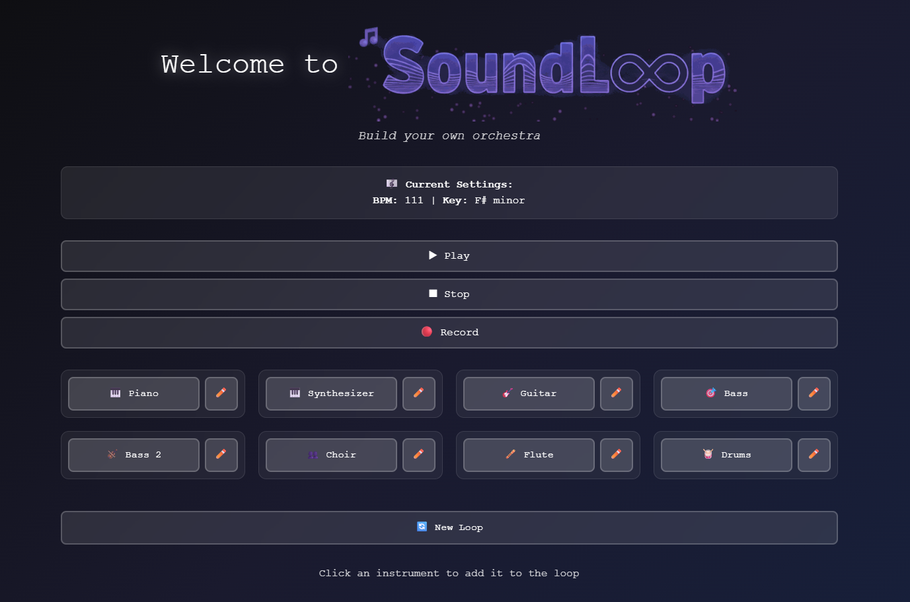

> Build your own orchestra.

SoundLoop is a procedural music generator designed to be a musical toy. The goal is not to be a complex production tool, but rather a fun and intuitive platform for creating simple, enjoyable musical loops.

---

## What is SoundLoop?

SoundLoop is a web application that allows anyone, regardless of musical knowledge, to create a piece of music. Through a simple interface, you can add instruments that play procedurally generated melodies and rhythms, creating a loop that evolves with each new layer. Think of it as an interactive, digital music box.

The primary focus is on **loop creation**. Every instrument you add joins a continuous cycle, allowing you to experiment with different combinations and sonic textures in real time.

## How It Works

Simplicity is at the core of SoundLoop. To create your music, just follow these steps:

1.  **Check the Settings:** At the top, you will see the current settings for your track, such as the **BPM** (beats per minute) and the **Key** (e.g., F# minor). All music will be generated within these parameters.
2.  **Add an Instrument:** Simply click on one of the available instruments (like Piano, Guitar, Drums, etc.) to add it to the loop.
3.  **Build Your Orchestra:** Add as many instruments as you like. Each one will contribute a new sonic layer, making the music richer and more complex.
4.  **Wanna Change Something?** You can edit with the ✏️ icon to taylor the melody of any instrument to your liking.
5.  **Control Playback:** Use the **Play** and **Stop** buttons to start or halt the music at any time.
6.  **Like It? Record It!** The **Record** button allows you to capture your creation.
7.  **Start Over:** Want to try a new combination? The **New Loop** button clears the current selection, giving you a blank canvas for your next masterpiece.

## Core Features

* **Procedural Generation:** Melodies and rhythms are not pre-recorded. They are generated based on a set of musical rules, ensuring that every combination feels unique.
* **Loop-Based System:** The heart of SoundLoop. Everything operates in a continuous cycle, perfect for creating captivating grooves and atmospheres.
* **Simple & Intuitive Interface:** A strong focus on fun and experimentation, free from complicated menus or overwhelming options.
* **Instrument Variety:** From classic instruments like Piano and Flute to modern elements like Synthesizers and electronic Drums.
* **Browser-Based:** No installation required. Just visit the site and start creating.

## The Concept Behind the Project

SoundLoop was born from the idea that creating music should be accessible and enjoyable for everyone. It does not aim to be a professional Digital Audio Workstation (DAW), and that is by design. It is, first and foremost, a **musical toy**.

The goal is to provide the joy of sonic discovery. It's about the satisfaction of adding a bass line and hearing how it interacts with the drums, or layering in a choir to completely change the mood. SoundLoop is a tool for relaxation, experimentation, and perhaps finding a spark of inspiration in a light, pressure-free environment.
